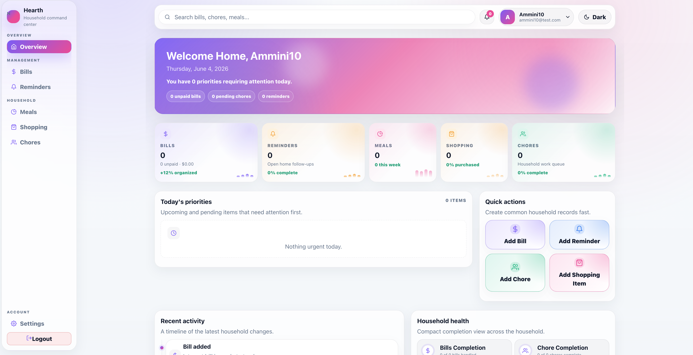
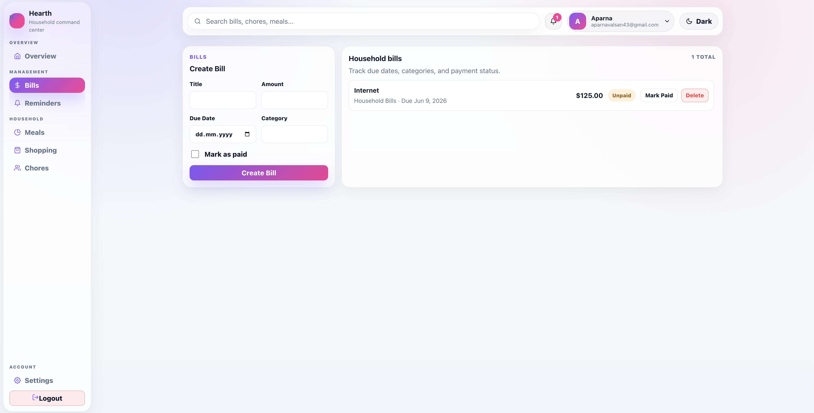
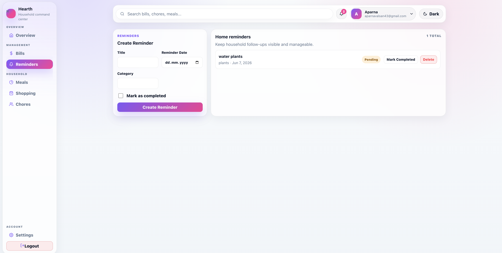
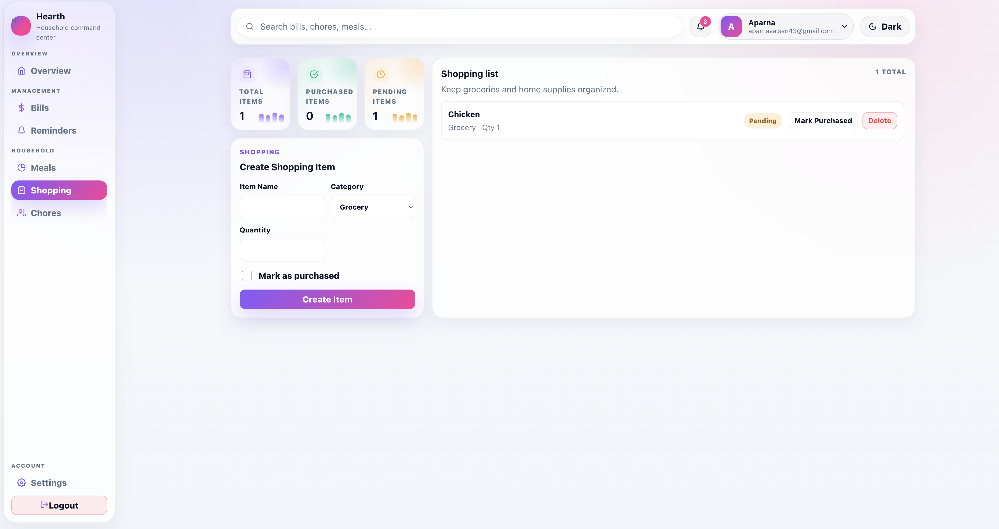
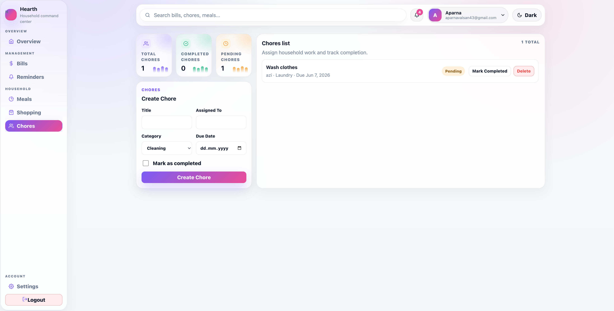
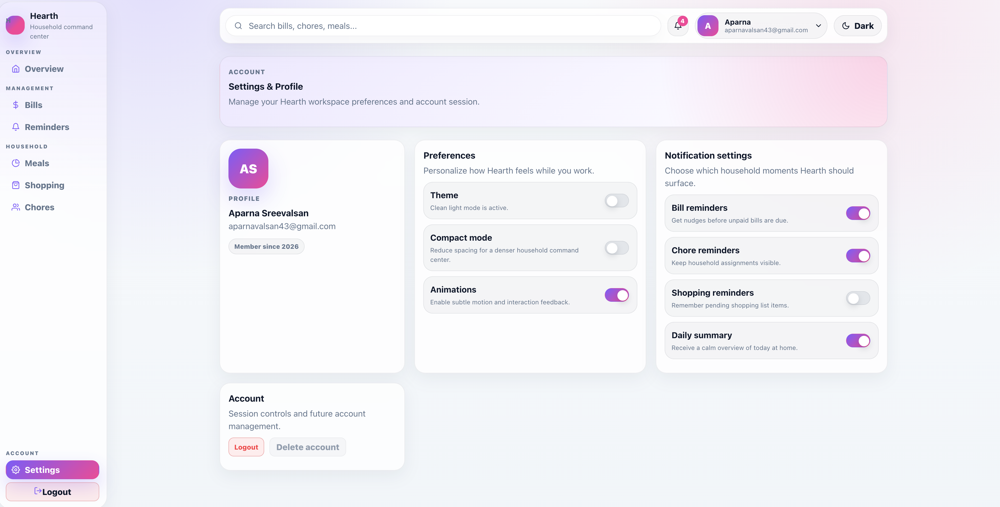

# 🏡 Hearth

A modern full-stack household management platform built with **React, Vite, ASP.NET Core, PostgreSQL, and JWT Authentication**.

Hearth helps individuals and families organize household responsibilities in one place by providing tools for managing bills, reminders, meals, shopping lists, and chores through a clean, modern SaaS dashboard.

---

## 🚀 Live Demo

### Frontend

https://hearth-three-psi.vercel.app

### Backend API (Swagger)

https://hearth-api-zyje.onrender.com/swagger

---

## 📸 Application Screenshots

### Dashboard



### Bills Management



### Reminders



### Shopping Lists



### Chores Management



### Settings



---

## ✨ Features

### 🔐 Authentication & Security

* User Registration
* User Login
* JWT Authentication
* Protected Routes
* Secure Password Storage
* Authorization-Based API Access

### 📊 Dashboard

* Modern SaaS-style user interface
* Household overview and insights
* Priority tracking
* Recent activity feed
* Household health metrics
* Responsive layout

### 💰 Bills Management

* Create household bills
* Track payment status
* View upcoming expenses
* Monitor paid and unpaid bills

### 🔔 Reminders

* Create reminders
* Mark reminders as completed
* Track pending follow-ups

### 🍽️ Meal Planning

* Plan meals ahead
* Organize weekly meals
* Track meal schedules

### 🛒 Shopping Lists

* Create shopping items
* Mark purchased items
* Manage household grocery lists

### 🧹 Chores Management

* Create chores
* Track chore completion
* Organize household responsibilities

### ⚙️ Settings

* Theme preferences
* Notification preferences
* User profile management
* Persistent user settings

---

## 🏗️ System Architecture

```text
Frontend (React + Vite)
          │
          ▼
ASP.NET Core Web API
          │
          ▼
Entity Framework Core
          │
          ▼
PostgreSQL Database (Neon)
```

---

## 🛠️ Tech Stack

| Layer             | Technology            |
| ----------------- | --------------------- |
| Frontend          | React                 |
| Build Tool        | Vite                  |
| Routing           | React Router          |
| API Communication | Axios                 |
| Backend           | ASP.NET Core Web API  |
| ORM               | Entity Framework Core |
| Authentication    | JWT                   |
| Database          | PostgreSQL            |
| Cloud Database    | Neon                  |
| Frontend Hosting  | Vercel                |
| Backend Hosting   | Render                |
| Version Control   | Git & GitHub          |

---

## 🎯 Key Highlights

✅ Full-Stack SaaS Application

✅ JWT Authentication & Authorization

✅ PostgreSQL Database Integration

✅ Entity Framework Core Migrations

✅ RESTful API Design

✅ Responsive Dashboard UI

✅ Cloud Deployment with Vercel, Render & Neon

✅ Production Environment Configuration

---

## 📂 Project Structure

```text
Hearth
├── backend
│   └── Hearth.Api
├── frontend
│   └── hearth-client
├── screenshots
│   ├── dashboard.png
│   ├── bills.png
│   ├── reminders.png
│   ├── shopping.png
│   ├── chores.png
│   └── settings.png
├── README.md
└── .gitignore
```

---

## ⚙️ Local Development Setup

### Clone Repository

```bash
git clone https://github.com/Aparnavalsan43/Hearth.git
cd Hearth
```

### Backend Setup

```bash
cd backend/Hearth.Api

dotnet restore

dotnet ef database update

dotnet run
```

Backend runs at:

```text
http://localhost:5253
```

### Frontend Setup

```bash
cd frontend/hearth-client

npm install

npm run dev
```

Frontend runs at:

```text
http://localhost:5173
```

---

## 🔐 Environment Variables

### Backend

Create or configure the following variables:

```env
ConnectionStrings__DefaultConnection=YOUR_DATABASE_CONNECTION

Jwt__Key=YOUR_SECRET_KEY

Jwt__Issuer=HearthAPI

Jwt__Audience=HearthClient
```

### Frontend

Create a `.env` file:

```env
VITE_API_BASE_URL=YOUR_API_URL
```

Example:

```env
VITE_API_BASE_URL=https://hearth-api-zyje.onrender.com/api
```

---

## 🌐 Deployment

| Service  | Platform        |
| -------- | --------------- |
| Frontend | Vercel          |
| Backend  | Render          |
| Database | Neon PostgreSQL |

---

## 🚀 Future Enhancements

* Multi-user household support
* Shared households
* Push notifications
* Calendar integration
* Recurring bills and chores
* AI-powered household assistant
* Mobile application
* Advanced analytics dashboard

---

## 🎓 Learning Outcomes

This project demonstrates:

* Full-Stack Development
* REST API Design
* Authentication & Authorization
* Database Design
* Entity Framework Core
* Cloud Deployment
* Modern SaaS UI Design
* Production Environment Configuration
* Frontend and Backend Integration

---

## 👩‍💻 Author

**Aparna Valsan**

GitHub: https://github.com/Aparnavalsan43

---

## 📄 License

This project is licensed under the MIT License.

---

## ⭐ Support

If you found this project useful, consider giving it a star on GitHub.

Feedback, suggestions, and contributions are always welcome.
